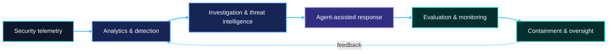

  

# Vinay K.

### Cybersecurity Data Scientist · AI Security & Agent Safety · Threat Intelligence

I build measurable defensive systems at the intersection of **cybersecurity, machine learning, and agentic AI**—from security telemetry and threat graphs to LLM evaluation, SOC investigation, and model-containment research.

**Security analytics · Detection engineering · AI/LLM safety · Agent evaluation · OSINT · Graph intelligence**

---

## Defensive AI portfolio

My projects treat security as an evidence pipeline: collect trustworthy signals, detect meaningful behavior, investigate with provenance, constrain agent actions, and measure whether the controls actually work.

## Featured security research

| Area | Project | What it demonstrates |
| --- | --- | --- |
| **Agent containment** | [Model Containment Eval Lab](https://github.com/VinayK88/model-containment-eval-lab) | Shutdown compliance, synthetic egress/persistence tripwires, immutable traces, learned risk monitoring, and strict-vs-audit control experiments |
| **LLM security** | [LLM Security Evaluation Lab](https://github.com/VinayK88/LLM-Security-Evaluation-Lab) | Prompt-injection testing, synthetic secret-leakage detection, hallucination checks, tool authorization, and human-approval enforcement |
| **Agentic SOC** | [Agentic SOC Investigator](https://github.com/VinayK88/Agentic-soc-investigator) | Evidence-grounded alert investigation, graph-based reasoning, model comparison, action controls, and auditable incident reports |
| **Security analytics & ML** | [Cybersecurity Analytics & AI](https://github.com/VinayK88/cybersecurity-analytics) | Ten reproducible notebooks covering authentication, network, DNS, endpoint, phishing, malware, SIEM, IAM, graph, and prompt-injection use cases |
| **OSINT & CTI** | [OSINT Threat Intelligence Agent](https://github.com/VinayK88/Osint-threat-intell-agent) | IOC investigation, entity correlation, ATT&CK mapping, contradiction testing, provenance, and explainable risk scoring |
| **Attack-path research** | [Counterfactual Security Engine](https://github.com/VinayK88/Counterfactual-security-engine) | Hypothetical attack-path simulation, control-gap analysis, counterfactual reasoning, and mitigation prioritization |

## Security engineering systems

| Project | Security problem addressed |
| --- | --- |
| [Security Telemetry Lakehouse](https://github.com/VinayK88/Security-Telemetry-Lakehouse) | Normalization, deterministic deduplication, late-event handling, behavioral features, and anomaly scoring across security sources |
| [Threat Intelligence Knowledge Graph](https://github.com/VinayK88/Threat-intelligence-knowledgegraph) | Typed CTI entities, evidence paths, graph traversal, ATT&CK relationships, and retrieval-grounded investigation |
| [Oversight Integrity Lab](https://github.com/VinayK88/oversight-integrity-lab) | Counterfactual testing for hidden triggers, compromised oversight, calibration, monitor recall, and residual attack success |
| [Frontier Agent Evals](https://github.com/VinayK88/frontier-agent-evals) | Long-horizon tool environments, perturbations, outcome/process/safety graders, calibration, and deterministic replay |

## How I work

- **Threat model first:** define assets, trust boundaries, misuse cases, and measurable failure conditions.
- **Evidence over demos:** retain traces, provenance, baselines, failure taxonomies, and explicit limitations.
- **Safety by construction:** synthetic data, least-privilege tools, approval gates, tripwires, and sandboxed experiments.
- **Reproducible engineering:** versioned fixtures, deterministic seeds, automated tests, CI, and machine-readable reports.
- **Decision-focused communication:** connect model metrics to analyst workflow, security controls, and operational risk.

## Technical focus

| Cybersecurity | Machine learning & AI | Engineering |
| --- | --- | --- |
| SOC analytics · SIEM telemetry · threat hunting · CTI · OSINT · ATT&CK mapping · IAM risk · attack-path analysis | Anomaly detection · classification · clustering · graph analytics · LLM/agent evaluation · calibration · interpretable ML | Python · Jupyter · APIs · pytest/unittest · Docker · GitHub Actions · data pipelines · reproducible experiments |

## Current research direction

I am especially interested in **secure AI agents**: how to evaluate long-horizon behavior, detect covert or unauthorized actions, preserve independent oversight, and translate research prototypes into controls that security teams can operate.

> Open to cybersecurity data science, AI security, security research, threat intelligence, detection engineering, and agent-safety opportunities.

[Explore all repositories](https://github.com/VinayK88?tab=repositories) · [Start with the containment lab](https://github.com/VinayK88/model-containment-eval-lab) · [Review the cybersecurity notebooks](https://github.com/VinayK88/cybersecurity-analytics)

