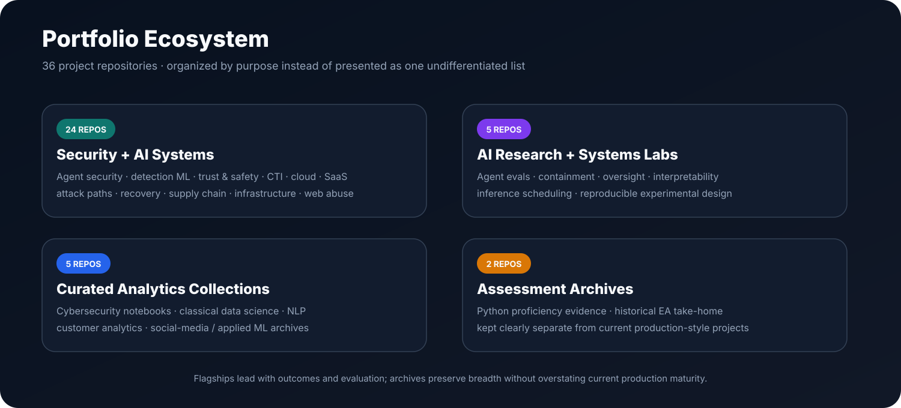

  

# Vinay K.

### Cybersecurity Data Scientist · AI Security · Security ML · Trust & Safety

**I build data-science and AI systems that measure whether security controls actually reduce risk — while keeping false positives, user friction, reliability, remediation, and downstream outcomes visible.**

`Security Measurement` · `Agent Security` · `Detection ML` · `Graph ML` · `Threat Intelligence` · `Model Monitoring` · `Trust & Safety`

---

## What I Focus On

The recurring question across my work is not simply whether a model can generate a score or detect an event. It is:

> **Did the system improve a real security outcome, and what operational cost did it introduce?**

That means measuring detection quality, false positives, task completion, analyst burden, approval latency, calibration, drift, remediation, verified resolution, and treatment effects rather than stopping at model accuracy.

  

---

# Cybersecurity & AI Security Portfolio

  

**Cybersecurity and AI-security work comes first throughout this profile.** General AI-systems research follows it, while older data-science, NLP, marketing, social-media, and assessment repositories are intentionally placed at the end as historical breadth.

## Flagship Projects

<table>
<tr>
<td width="50%" valign="top">

### [AgentShield](https://github.com/VinayK88/AgentShield)
**AI-agent runtime security + safeguard measurement**

Intent-aware controls with `ALLOW / REDACT / APPROVAL / BLOCK`, learned trajectory-risk signals, and explicit measurement of **risk reduction vs. user friction**.

</td>
<td width="50%" valign="top">

### [VulnSignal](https://github.com/VinayK88/VulnSignal)
**AI security finding quality + remediation intelligence**

Measures the complete lifecycle after an AI system reports a vulnerability: correctness, severity, duplication, actionability, developer acceptance, remediation, and verified resolution.

</td>
</tr>
<tr>
<td width="50%" valign="top">

### [LLM Security Evaluation Lab](https://github.com/VinayK88/LLM-Security-Evaluation-Lab)
**Model and agent safeguard evaluation**

Versioned benchmarks for prompt injection, leakage, tool authorization, human approval, repeated trials, and longitudinal misuse/intervention quality.

</td>
<td width="50%" valign="top">

### [DetectionForge](https://github.com/VinayK88/DetectionForge)
**Detection engineering + ML prioritization**

Detection-as-code with replay-based precision/recall/FPR release gates, ATT&CK coverage, supervised alert ranking, and active-learning review queues.

</td>
</tr>
<tr>
<td width="50%" valign="top">

### [RiskOS](https://github.com/VinayK88/riskos)
**Trust & Safety decision science**

Behavioral, graph, sequence, calibration, exposure, and capacity-aware risk decisioning with explicit `ALLOW / CHALLENGE / REVIEW / BLOCK` outcomes.

</td>
<td width="50%" valign="top">

### [AdversarialWeb](https://github.com/VinayK88/AdversarialWeb-Behavioral-Bot-ATO-Web-Attack-Detection)
**Behavioral bot / scraping / credential-stuffing / ATO detection**

FP/FN investigation, targeted feature and threshold improvements, XGBoost, Isolation Forest, DBSCAN campaign discovery, and analyst-facing dashboards.

</td>
</tr>
</table>

---

## All Cybersecurity & AI Security Projects · 28

### Agentic AI, LLM Security & AI Assurance

| Project | Focus |
| --- | --- |
| [AgentShield](https://github.com/VinayK88/AgentShield) | Runtime AI-agent security, tool policy, trajectory risk, safeguard measurement |
| [VulnSignal](https://github.com/VinayK88/VulnSignal) | AI vulnerability-finding quality, model routing, developer remediation outcomes |
| [Agentic SOC Investigator](https://github.com/VinayK88/Agentic-soc-investigator) | Evidence-grounded SOC investigation, enrichment, ATT&CK mapping |
| [AegisMesh](https://github.com/VinayK88/AegisMesh) | Multi-agent security orchestration with Red / Blue / Green agents and policy-gated tools |
| [AgentAtlas](https://github.com/VinayK88/AgentAtlas) | AI-agent inventory, posture, effective access, permission drift, anomaly prioritization |
| [LLM Security Evaluation Lab](https://github.com/VinayK88/LLM-Security-Evaluation-Lab) | Prompt injection, leakage, tool authorization, actor-level misuse, intervention evaluation |
| [Frontier Agent Evals](https://github.com/VinayK88/frontier-agent-evals) | Long-horizon agent outcome, process, safety, efficiency, and calibration evaluation |
| [Model Containment Eval Lab](https://github.com/VinayK88/model-containment-eval-lab) | Shutdown compliance, containment, tripwires, trace-risk monitoring |
| [Oversight Integrity Lab](https://github.com/VinayK88/oversight-integrity-lab) | Counterfactual testing for compromised oversight and monitor effectiveness |
| [InfraGuard AI](https://github.com/VinayK88/InfraGuard-AI) | Critical-infrastructure AI assurance, provenance, safety envelopes, degraded-safe operation |

### Detection Engineering, Web Security & Endpoint Security

| Project | Focus |
| --- | --- |
| [DetectionForge](https://github.com/VinayK88/DetectionForge) | Detection-as-code, replay metrics, release gates, ML alert prioritization |
| [AdversarialWeb](https://github.com/VinayK88/AdversarialWeb-Behavioral-Bot-ATO-Web-Attack-Detection) | Bot, scraping, credential stuffing, ATO, detection-gap analysis |
| [BrowserGuard](https://github.com/VinayK88/BrowserGuard) | Browser-extension risk, session exposure, permission drift, hybrid anomaly detection |
| [MacSentinel](https://github.com/VinayK88/macsentinel) | macOS threat analytics, provenance graphs, streaming ML, robustness testing |
| [Security Telemetry Lakehouse](https://github.com/VinayK88/Security-Telemetry-Lakehouse) | Security-event normalization, dedupe, watermarking, feature windows, explainable detections |
| [Cybersecurity Analytics & AI](https://github.com/VinayK88/cybersecurity-analytics) | 32 synthetic/offline security notebooks across identity, endpoint, network, SIEM, AI safety, OSINT and purple-team analytics |

### Identity, SaaS, Cloud & Attack-Path Security

| Project | Focus |
| --- | --- |
| [AttackPath AI](https://github.com/VinayK88/attackpath-ai) | Cross-source identity and agentic attack-path detection |
| [Counterfactual Security Engine](https://github.com/VinayK88/Counterfactual-security-engine) | Attack-path simulation and defensive intervention ranking |
| [SaaSGraph](https://github.com/VinayK88/SaaSGraph) | OAuth/SaaS exposure, token behavior, anomaly detection, blast radius |
| [CloudRescue](https://github.com/VinayK88/CloudRescue) | Cloud ransomware recovery assurance, recoverability gates, restore forecasting |
| [AI Data Center Security Digital Twin](https://github.com/VinayK88/ai-datacenter-security-digital-twin) | Cyber-physical attack paths, blast radius, multivariate infrastructure telemetry ML |
| [GPU Trust Guardian](https://github.com/VinayK88/gpu-trust-guardian) | GPU trust, attestation, workload behavior, attack paths, analyst-agent guardrails |

### Threat Intelligence, Supply Chain & Security Decision Science

| Project | Focus |
| --- | --- |
| [Threat Intelligence Knowledge Graph](https://github.com/VinayK88/Threat-intelligence-knowledgegraph) | CTI evidence paths, graph retrieval, analyst-gated link prediction |
| [OSINT Threat Intelligence Agent](https://github.com/VinayK88/Osint-threat-intell-agent) | Evidence-grounded IOC investigation, provenance, contradictions, ATT&CK context |
| [DeepTrace](https://github.com/VinayK88/DeepTrace) | Content authenticity, provenance analysis, NLP campaign clustering |
| [SupplyChain Guardian AI](https://github.com/VinayK88/supplychain-guardian-ai) | SBOM, CI/CD, build provenance, dependency risk, policy release gates |
| [SignalForge](https://github.com/VinayK88/SignalForge) | Fraud / abuse / operational-risk ML with graph signals and cost-aware decisions |
| [RiskOS](https://github.com/VinayK88/riskos) | Trust & Safety risk decisioning, calibration, exposure, capacity-aware policy optimization |

---

## Production Security / ML Practices Demonstrated

| Practice | Examples across the cybersecurity portfolio |
| --- | --- |
| **Evaluation** | Holdouts, hard negatives, replay, long-horizon graders, FP/FN analysis, calibration |
| **Detection quality** | Precision, recall, FPR, severity, actionability, attack-family recall, release gates |
| **Monitoring** | PSI-style drift, workflow-health signals, model/version tracking, distribution movement |
| **Robustness** | Prompt injection, low-and-slow behavior, permission growth, mimicry, shifted populations |
| **Explainability** | Rule reasons, feature deviations, evidence paths, attack graphs, sequence transitions |
| **Human-in-the-loop** | Approval gates, analyst queues, active learning, developer dispositions, remediation verification |
| **Safe automation** | Deterministic authorization and policy controls remain separate from learned model scores |
| **Engineering** | Python, SQL, PySpark, FastAPI, Streamlit, Docker, GitHub Actions, Jupyter |

> **Evaluation boundary:** many public security projects use deterministic synthetic fixtures because production security telemetry is sensitive. Reported metrics demonstrate implementation and evaluation mechanics rather than production efficacy claims.

---

## Additional AI Systems Research · 2

These are current technical projects, but they are intentionally placed **after** the cybersecurity portfolio because they are not primarily cybersecurity projects.

- [Sparse Feature Interpretability Lab](https://github.com/VinayK88/sparse-feature-interpretability-lab) — sparse autoencoders, feature recovery, causal latent interventions.
- [Inference Scheduler Lab](https://github.com/VinayK88/inference-scheduler-lab) — continuous batching, SLO-aware admission, throughput/latency/KV-cache trade-offs.

---

# Older Data Science & Analytics Archives

These repositories preserve earlier breadth. They are intentionally kept at the **back of the portfolio** so they do not compete with the current cybersecurity / AI-security work.

<b>Foundational analytics repositories</b>

 

- [Data Science Projects](https://github.com/VinayK88/Data-Science-Projects) — foundational fraud, credit-risk, insurance, customer-lifetime-value, attrition, lending, and predictive-modeling work.
- [NLP Projects](https://github.com/VinayK88/NLP-Projects) — text classification, sentiment, topic modeling, summarization, intent detection, and chatbots.
- [Customer & Marketing Analytics](https://github.com/VinayK88/Customer-Marketing-analytics-projects) — A/B testing, uplift, segmentation, retention, purchase modeling, churn, and forecasting.
- [Social Media Mining](https://github.com/VinayK88/Social-media-mining) — historical platform-data collection and classical applied-ML exercises.

<b>Historical assessment archives</b>

 

- [Python Proficiency Test](https://github.com/VinayK88/Python-Proficiency-Test) — preserved historical assessment artifact.
- [Electronic Arts Data Science Take-Home](https://github.com/VinayK88/Electronic-Arts-Data-science-test) — preserved historical take-home notebook.

---

## Technical Focus

**Security:** AI / agent security · detection engineering · identity / IAM · threat intelligence · cloud / SaaS security · Trust & Safety · application/web security · attack-path analysis · MITRE ATT&CK

**ML / Data Science:** supervised learning · Gradient Boosting · Isolation Forest · sequence modeling · graph ML · anomaly detection · clustering · calibration · experimentation · active learning · drift monitoring

**Engineering:** Python · SQL · PySpark / Spark · FastAPI · Streamlit · scikit-learn · NetworkX · Docker · GitHub Actions · Jupyter

---

### Cybersecurity Portfolio

[**AgentShield**](https://github.com/VinayK88/AgentShield) · [**VulnSignal**](https://github.com/VinayK88/VulnSignal) · [**DetectionForge**](https://github.com/VinayK88/DetectionForge) · [**AdversarialWeb**](https://github.com/VinayK88/AdversarialWeb-Behavioral-Bot-ATO-Web-Attack-Detection)  
[**LLM Security Evaluation Lab**](https://github.com/VinayK88/LLM-Security-Evaluation-Lab) · [**AttackPath AI**](https://github.com/VinayK88/attackpath-ai) · [**AegisMesh**](https://github.com/VinayK88/AegisMesh) · [**RiskOS**](https://github.com/VinayK88/riskos)

[Browse all repositories →](https://github.com/VinayK88?tab=repositories)

