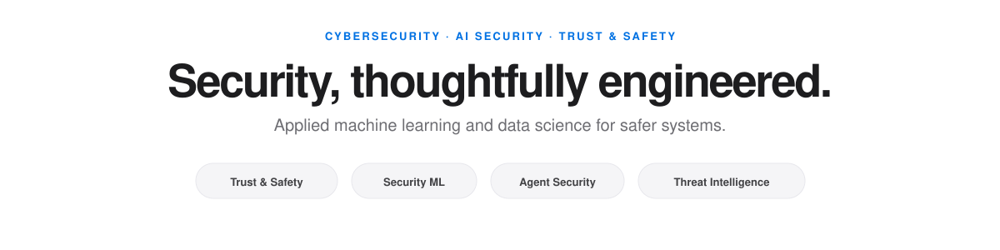

  

  

[**MessageShield**](https://github.com/VinayK88/MessageShield-RCS-Trust-Safety) &nbsp;&nbsp;·&nbsp;&nbsp; [**CallShield AI**](https://github.com/VinayK88/-CallShield-AI) &nbsp;&nbsp;·&nbsp;&nbsp; [**AgentShield**](https://github.com/VinayK88/AgentShield) &nbsp;&nbsp;·&nbsp;&nbsp; [**Threat Intelligence Graph**](https://github.com/VinayK88/Threat-intelligence-knowledgegraph)

 

`Python` &nbsp; `SQL` &nbsp; `XGBoost` &nbsp; `scikit-learn` &nbsp; `Streamlit` &nbsp; `FastAPI` &nbsp; `NetworkX` &nbsp; `Docker`

 

---

## Featured systems

### Four focused products across consumer safety and security ML.

 

<table>
<tr>
<td width="50%" valign="top">

### 💬 [MessageShield](https://github.com/VinayK88/MessageShield-RCS-Trust-Safety)
**Messaging Trust & Safety**

Spam, phishing, impersonation, coordinated abuse, experimentation, and policy decisioning for RCS / RBM-style messaging.

`NLP` · `Graph signals` · `Behavioral ML` · `A/B testing` · `Counterfactual analysis`

</td>
<td width="50%" valign="top">

### ☎️ [CallShield AI](https://github.com/VinayK88/-CallShield-AI)
**Voice Trust & Safety**

Scam-call, robocall, impersonation, and coordinated-campaign detection with explainable ML.

`XGBoost` · `Isolation Forest` · `Ensemble risk` · `SHAP-style explainability` · `≤2% FPR guardrail`

</td>
</tr>
<tr>
<td width="50%" valign="top">

### ◉ [DeepTrace](https://github.com/VinayK88/DeepTrace)
**Content Integrity**

Content authenticity, provenance analysis, semantic similarity, and coordinated narrative discovery.

`Provenance` · `TF-IDF` · `DBSCAN` · `Semantic similarity` · `Campaign clustering`

</td>
<td width="50%" valign="top">

### ◇ [RiskOS](https://github.com/VinayK88/riskos)
**Trust & Safety Decisioning**

Calibrated risk decisions under exposure, capacity, and operational constraints.

`Calibration` · `Exposure modeling` · `Policy optimization` · `Capacity-aware decisions`

</td>
</tr>
</table>

 

---

## Trust & Safety · Fraud · Abuse

### Consumer protection, abuse detection, content integrity, and risk decisioning.

 

| Project | Focus |
| --- | --- |
| [**MessageShield**](https://github.com/VinayK88/MessageShield-RCS-Trust-Safety) | RCS/RBM spam, phishing, impersonation, graph abuse signals, experiments, counterfactual analysis |
| [**CallShield AI**](https://github.com/VinayK88/-CallShield-AI) | Scam calls, robocalls, voice impersonation, behavioral ML, anomaly detection, explainability |
| [**DeepTrace**](https://github.com/VinayK88/DeepTrace) | Content authenticity, provenance, semantic similarity, coordinated narrative clustering |
| [**RiskOS**](https://github.com/VinayK88/riskos) | Calibrated Trust & Safety decisioning, exposure modeling, policy optimization |
| [**SignalForge**](https://github.com/VinayK88/SignalForge) | Fraud, abuse, and operational-risk ML with graph signals and cost-aware decisions |
| [**PhishGraph AI**](https://github.com/VinayK88/PhishGraph-AI) | Phishing/BEC detection using identity, URL, behavioral, and campaign-graph signals |

 

---

## AI · Agent · LLM Security

### Security and evaluation for systems that reason, act, and use tools.

 

| Project | Focus |
| --- | --- |
| [**AgentShield**](https://github.com/VinayK88/AgentShield) | Runtime AI-agent security, tool policy, trajectory risk, safeguard measurement |
| [**AegisMesh**](https://github.com/VinayK88/AegisMesh) | Multi-agent security orchestration with policy-gated tools |
| [**AgentAtlas**](https://github.com/VinayK88/AgentAtlas) | AI-agent inventory, effective access, permission drift, anomaly prioritization |
| [**LLM Security Evaluation Lab**](https://github.com/VinayK88/LLM-Security-Evaluation-Lab) | Prompt injection, leakage, misuse, tool authorization, intervention evaluation |
| [**Frontier Agent Evals**](https://github.com/VinayK88/frontier-agent-evals) | Long-horizon agent outcomes, process safety, efficiency, and calibration |
| [**Model Containment Eval Lab**](https://github.com/VinayK88/model-containment-eval-lab) | Shutdown compliance, containment, tripwires, trace-risk monitoring |
| [**Oversight Integrity Lab**](https://github.com/VinayK88/oversight-integrity-lab) | Counterfactual testing for compromised oversight and monitor effectiveness |
| [**VulnSignal**](https://github.com/VinayK88/VulnSignal) | AI vulnerability-finding quality, model routing, validation, remediation outcomes |

 

---

## Security Operations · Detection · Endpoint

### From raw telemetry to investigation, prioritization, and explainable detections.

 

| Project | Focus |
| --- | --- |
| [**DetectionForge**](https://github.com/VinayK88/DetectionForge) | Detection-as-code, replay metrics, release gates, ML alert prioritization |
| [**Agentic SOC Investigator**](https://github.com/VinayK88/Agentic-soc-investigator) | Evidence-grounded SOC investigation, enrichment, ATT&CK mapping |
| [**InsiderGuard**](https://github.com/VinayK88/InsiderGuard) | UEBA, DLP, peer baselines, insider risk, exfiltration-sequence detection |
| [**Security Telemetry Lakehouse**](https://github.com/VinayK88/Security-Telemetry-Lakehouse) | Event normalization, dedupe, watermarking, feature windows, explainable detections |
| [**BrowserGuard**](https://github.com/VinayK88/BrowserGuard) | Browser-extension risk, session exposure, permission drift, hybrid anomaly detection |
| [**MacSentinel**](https://github.com/VinayK88/macsentinel) | macOS threat analytics, provenance graphs, streaming ML, robustness testing |
| [**Cybersecurity Analytics & AI**](https://github.com/VinayK88/cybersecurity-analytics) | Identity, endpoint, network, SIEM, AI-safety, OSINT, and purple-team analytics |

 

---

## Application · Web Security

### Secure code, application behavior, and adversarial web activity.

 

| Project | Focus |
| --- | --- |
| [**CodeSentinel AI**](https://github.com/VinayK88/CodeSentinel-AI) | AI-native secure code review, CWE mapping, finding validation, remediation tracking |
| [**AdversarialWeb**](https://github.com/VinayK88/AdversarialWeb-Behavioral-Bot-ATO-Web-Attack-Detection) | Bots, scraping, credential stuffing, account takeover, detection-gap analysis |

 

---

## Cloud · Identity · Infrastructure · Attack Paths

### Identity exposure, blast radius, recovery, infrastructure trust, and attack-path reasoning.

 

| Project | Focus |
| --- | --- |
| [**AttackPath AI**](https://github.com/VinayK88/attackpath-ai) | Cross-source identity and agentic attack-path detection |
| [**SaaSGraph**](https://github.com/VinayK88/SaaSGraph) | OAuth/SaaS exposure, token behavior, anomaly detection, blast radius |
| [**Counterfactual Security Engine**](https://github.com/VinayK88/Counterfactual-security-engine) | Attack-path simulation and defensive intervention ranking |
| [**CloudRescue**](https://github.com/VinayK88/CloudRescue) | Cloud ransomware recovery assurance, recoverability gates, restore forecasting |
| [**InfraGuard AI**](https://github.com/VinayK88/InfraGuard-AI) | Critical-infrastructure AI assurance, provenance, safety envelopes, degraded-safe operation |
| [**GPU Trust Guardian**](https://github.com/VinayK88/gpu-trust-guardian) | GPU trust, attestation, workload behavior, attack paths, analyst-agent guardrails |
| [**AI Data Center Security Digital Twin**](https://github.com/VinayK88/ai-datacenter-security-digital-twin) | Cyber-physical attack paths, blast radius, multivariate infrastructure telemetry ML |

 

---

## Threat Intelligence · OSINT · Supply Chain

### Evidence, provenance, graph context, and software-supply-chain risk.

 

| Project | Focus |
| --- | --- |
| [**Threat Intelligence Knowledge Graph**](https://github.com/VinayK88/Threat-intelligence-knowledgegraph) | CTI evidence paths, graph retrieval, analyst-gated link prediction |
| [**OSINT Threat Intelligence Agent**](https://github.com/VinayK88/Osint-threat-intell-agent) | IOC investigation, provenance, contradictions, ATT&CK context |
| [**SupplyChain Guardian AI**](https://github.com/VinayK88/supplychain-guardian-ai) | SBOM, CI/CD, build provenance, dependency risk, policy release gates |

 

---

## Applied ML across security

### Predict. Reason. Decide.

 

<table>
<tr>
<td width="33%" valign="top"><b>Prediction</b>  Classification Gradient boosting Anomaly detection Ensemble modeling</td>
<td width="33%" valign="top"><b>Reasoning</b>  Graph analytics NLP Clustering Attack-path analysis</td>
<td width="33%" valign="top"><b>Decisioning</b>  Calibration Explainability A/B testing Counterfactual analysis</td>
</tr>
</table>

  

### Build the signal. Understand the risk. Improve the decision.

`AI Security` · `Security ML` · `Detection Engineering` · `Application Security` · `Threat Intelligence` · `Cloud Security` · `Identity Security` · `Trust & Safety`

 

