  

# Vinay K.

### Cybersecurity Data Scientist · AI Security Engineer · Threat Intelligence

I build **explainable, evidence-driven security systems** across software supply chains, identity attack paths, macOS endpoints, GPU/AI infrastructure, SOC analytics, and AI-agent safety.

**Supply-chain trust · Detection engineering · Identity security · Endpoint analytics · GPU trust · Agent containment**

---

## Cybersecurity portfolio map

```mermaid
flowchart LR
    SC["Software supply chain<br/>SBOM · CI/CD · provenance"] --> ID["Identity & attack paths<br/>Cloud · SaaS · AI agents"]
    ID --> EP["Endpoint security<br/>macOS · behavior · sequences"]
    EP --> GPU["GPU & AI infrastructure<br/>Attestation · behavior · policy"]
    GPU --> SOC["SOC analytics<br/>Detection · investigation · CTI"]
    SOC --> AS["AI-agent safety<br/>Evaluation · oversight · containment"]
    AS -. "policy and evidence feedback" .-> SC

    classDef trust fill:#7f1d1d,stroke:#fca5a5,color:#fff,stroke-width:2px
    classDef detect fill:#172554,stroke:#60a5fa,color:#fff,stroke-width:2px
    classDef respond fill:#312e81,stroke:#c4b5fd,color:#fff,stroke-width:2px
    classDef safety fill:#042f2e,stroke:#5eead4,color:#fff,stroke-width:2px
    class SC trust
    class ID,EP,GPU detect
    class SOC respond
    class AS safety
    linkStyle default stroke:#ef4444,stroke-width:2px
```

Every project follows the same defensive loop: **collect trustworthy signals → build explainable evidence → apply measurable ML → support an analyst decision → enforce policy**.

## Flagship cybersecurity systems

| Project | The security question | What you can inspect |
| --- | --- | --- |
| **[SupplyChain Guardian AI](https://github.com/VinayK88/supplychain-guardian-ai)** | Can we trust a dependency, build, and release before it reaches production? | SBOM and CI/CD analysis, provenance graphs, interpretable ML, policy gates, SARIF/JSON output, FastAPI, Streamlit, tests, and three executed notebooks |
| **[GPU Trust Guardian](https://github.com/VinayK88/gpu-trust-guardian)** | Can sensitive AI workloads trust the GPU, its behavior, and the analyst agent before model or data access? | NVIDIA-focused GPU telemetry, synthetic attestation, digital fingerprints, attack paths, explainable policy gates, agent guardrails, dashboard, and four executed notebooks |
| **[AttackPath AI](https://github.com/VinayK88/attackpath-ai)** | Can defenders connect identity, endpoint, cloud, SaaS, GitHub, and agent signals before exfiltration? | A safe synthetic cyber range, explainable attack-path detection, graph evidence, dashboard, and executed evaluation notebook |
| **[MacSentinel](https://github.com/VinayK88/macsentinel)** | Can macOS behavior become useful detections without collecting sensitive content? | Swift-native telemetry, privacy-preserving features, provenance graphs, streaming/sequence/graph ML, drift tests, dashboard, and six executed notebooks |

> These projects use transparent synthetic fixtures and cyber ranges so the experiments are safe, reproducible, and honest about what the reported metrics prove.

## Security analytics, SOC & AI safety

| Area | Project | What it demonstrates |
| --- | --- | --- |
| **Security analytics & ML** | [Cybersecurity Analytics & AI](https://github.com/VinayK88/cybersecurity-analytics) | **25 reproducible notebooks** spanning core defensive analytics, ethical OSINT, red-team simulation, blue-team detection, purple-team validation, graphs, and AI security |
| **Agent containment** | [Model Containment Eval Lab](https://github.com/VinayK88/model-containment-eval-lab) | Shutdown compliance, synthetic egress/persistence tripwires, immutable traces, learned risk monitoring, and strict-vs-audit control experiments |
| **Agentic SOC** | [Agentic SOC Investigator](https://github.com/VinayK88/Agentic-soc-investigator) | Evidence-grounded alert investigation, graph reasoning, model comparison, action controls, and auditable incident reports |
| **LLM security** | [LLM Security Evaluation Lab](https://github.com/VinayK88/LLM-Security-Evaluation-Lab) | Prompt-injection testing, synthetic leakage detection, hallucination checks, tool authorization, and human-approval enforcement |
| **OSINT & CTI** | [OSINT Threat Intelligence Agent](https://github.com/VinayK88/Osint-threat-intell-agent) | IOC investigation, entity correlation, ATT&CK mapping, contradiction testing, provenance, and explainable risk scoring |

## Research & security infrastructure

| Project | Security problem addressed |
| --- | --- |
| [Security Telemetry Lakehouse](https://github.com/VinayK88/Security-Telemetry-Lakehouse) | Normalization, deterministic deduplication, late-event handling, behavioral features, and anomaly scoring across security sources |
| [Threat Intelligence Knowledge Graph](https://github.com/VinayK88/Threat-intelligence-knowledgegraph) | Typed CTI entities, evidence paths, graph traversal, ATT&CK relationships, and retrieval-grounded investigation |
| [Counterfactual Security Engine](https://github.com/VinayK88/Counterfactual-security-engine) | Hypothetical attack-path simulation, control-gap analysis, counterfactual reasoning, and mitigation prioritization |
| [Oversight Integrity Lab](https://github.com/VinayK88/oversight-integrity-lab) | Counterfactual testing for hidden triggers, compromised oversight, calibration, monitor recall, and residual attack success |
| [Frontier Agent Evals](https://github.com/VinayK88/frontier-agent-evals) | Long-horizon tool environments, perturbations, outcome/process/safety graders, calibration, and deterministic replay |

## What the portfolio demonstrates

| Security layer | Practical proof |
| --- | --- |
| **Prevent** | Dependency, SBOM, CI/CD, build-provenance, GPU-attestation, and policy-gate analysis |
| **Detect** | Identity, endpoint, GPU workload, network, DNS, IAM, prompt-injection, and sequence/graph detections |
| **Investigate** | Evidence graphs, ATT&CK mapping, OSINT correlation, attack paths, and auditable timelines |
| **Respond safely** | Approval gates, least-privilege tools, machine-readable findings, and analyst-facing dashboards |
| **Evaluate** | Executed notebooks, deterministic fixtures, baselines, ablations, failure analysis, tests, and CI |

## How I work

- **Threat model first:** define assets, trust boundaries, abuse cases, and measurable failure conditions.
- **Evidence over demos:** preserve traces, provenance, baselines, limitations, and machine-readable findings.
- **Safety by construction:** use synthetic data, least-privilege tools, approval gates, tripwires, and sandboxed experiments.
- **Interpretable ML:** combine rules, graph reasoning, classical ML, sequence models, and LLMs only where each is useful.
- **Reproducible engineering:** ship versioned fixtures, deterministic seeds, tests, CI, executed notebooks, APIs, and dashboards.

## Technical focus

| Cybersecurity | Machine learning & AI | Engineering |
| --- | --- | --- |
| Software supply chain · SBOM · CI/CD · macOS security · GPU/AI infrastructure security · identity/IAM · SOC · SIEM · CTI/OSINT · ATT&CK · attack paths | Anomaly detection · classification · sequence models · graph analytics · interpretable ML · LLM/agent evaluation · calibration | Python · Swift · Jupyter · Streamlit · FastAPI · NVML/Morpheus integration patterns · SARIF · pytest · Docker · GitHub Actions · reproducible pipelines |

## Current research direction

I am exploring how defenders can establish trust across the full chain—from **source and build provenance**, through **identity, endpoint, and GPU workload behavior**, to **AI agents that must remain observable, controllable, and safely contained**.

> Open to cybersecurity data science, AI security, security research, threat intelligence, detection engineering, software supply-chain security, and agent-safety opportunities.

[Start with SupplyChain Guardian AI](https://github.com/VinayK88/supplychain-guardian-ai) · [Explore GPU Trust Guardian](https://github.com/VinayK88/gpu-trust-guardian) · [Explore AttackPath AI](https://github.com/VinayK88/attackpath-ai) · [Review MacSentinel](https://github.com/VinayK88/macsentinel) · [Browse all repositories](https://github.com/VinayK88?tab=repositories)

