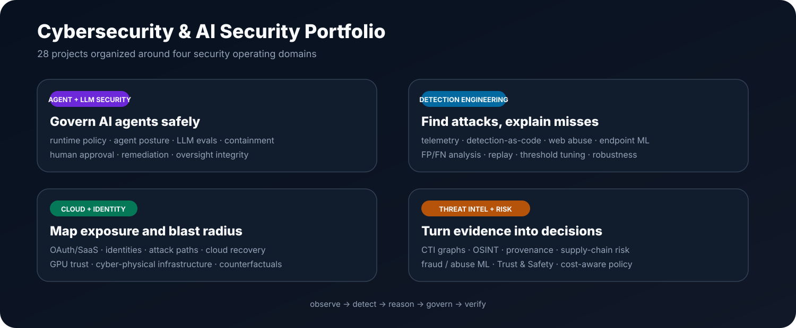
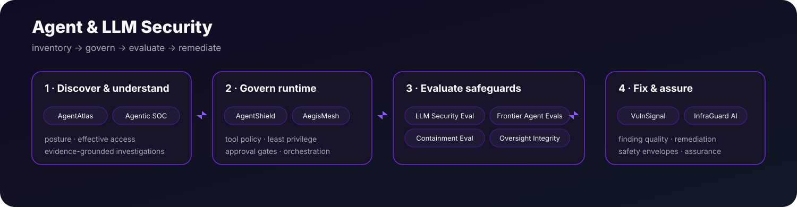
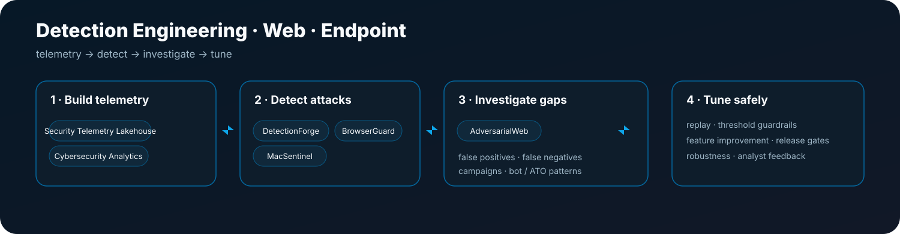
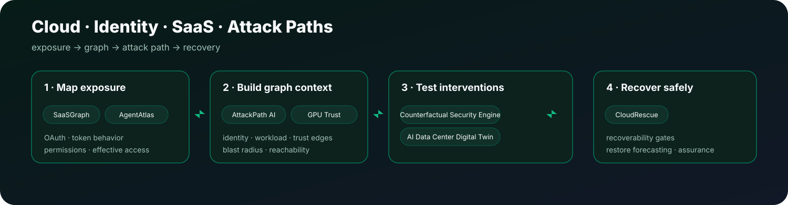
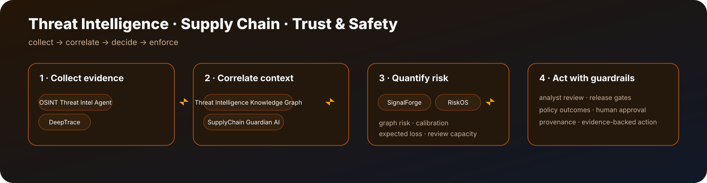

  

# Cybersecurity · AI Security · Trust & Safety

**Applied security data science across AI agents, detection engineering, consumer Trust & Safety, threat intelligence, cloud, identity, endpoint, infrastructure, and adversarial-risk systems.**

### Core Technology Stack

  

---

## Featured Trust & Safety Systems

| Project | Product problem | Data science / ML |
| --- | --- | --- |
| [**MessageShield — RCS / RBM Trust & Safety**](https://github.com/VinayK88/MessageShield-RCS-Trust-Safety) | Protect messaging ecosystems from spam, phishing, scams, impersonation and coordinated abuse | NLP, behavioral features, graph signals, anomaly monitoring, A/B testing, counterfactual analysis, policy decisioning |
| [**CallShield AI — Voice Trust & Safety**](https://github.com/VinayK88/-CallShield-AI) | Detect scam calls, robocalls, impersonation and coordinated calling campaigns | TF-IDF, XGBoost, Isolation Forest, ensemble risk, ≤2% FPR guardrail, SHAP-style explainability, campaign scoring |
| [**DeepTrace**](https://github.com/VinayK88/DeepTrace) | Assess content authenticity and surface coordinated narrative amplification | provenance-aware evidence fusion, TF-IDF, DBSCAN, semantic similarity, campaign clustering |
| [**RiskOS**](https://github.com/VinayK88/riskos) | Turn risk scores into calibrated Trust & Safety decisions under operational constraints | calibration, exposure modeling, policy optimization, capacity-aware decisioning |

### Current Trust & Safety coverage

`Messaging abuse` → `Voice scams` → `Content integrity` → `Fraud / abuse risk` → `Policy decisioning` → `Experimentation` → `Explainability`

---

## Agent & LLM Security

  

| Project | Security focus |
| --- | --- |
| [**AgentShield**](https://github.com/VinayK88/AgentShield) | Runtime AI-agent security, tool policy, trajectory risk, safeguard measurement |
| [**VulnSignal**](https://github.com/VinayK88/VulnSignal) | AI vulnerability-finding quality, model routing, remediation outcomes |
| [**AegisMesh**](https://github.com/VinayK88/AegisMesh) | Multi-agent security orchestration with policy-gated tools |
| [**AgentAtlas**](https://github.com/VinayK88/AgentAtlas) | AI-agent inventory, posture, effective access, permission drift, anomaly prioritization |
| [**Agentic SOC Investigator**](https://github.com/VinayK88/Agentic-soc-investigator) | Evidence-grounded SOC investigation, enrichment and ATT&CK mapping |
| [**LLM Security Evaluation Lab**](https://github.com/VinayK88/LLM-Security-Evaluation-Lab) | Prompt injection, leakage, tool authorization, misuse and intervention evaluation |
| [**Frontier Agent Evals**](https://github.com/VinayK88/frontier-agent-evals) | Long-horizon agent outcome, process, safety, efficiency and calibration evaluation |
| [**Model Containment Eval Lab**](https://github.com/VinayK88/model-containment-eval-lab) | Shutdown compliance, containment, tripwires and trace-risk monitoring |
| [**Oversight Integrity Lab**](https://github.com/VinayK88/oversight-integrity-lab) | Counterfactual testing for compromised oversight and monitor effectiveness |
| [**InfraGuard AI**](https://github.com/VinayK88/InfraGuard-AI) | Critical-infrastructure AI assurance, provenance, safety envelopes and degraded-safe operation |

---

## Detection Engineering · Web · Endpoint

  

| Project | Security focus |
| --- | --- |
| [**CodeSentinel AI**](https://github.com/VinayK88/CodeSentinel-AI) | AI-native secure code review, CWE mapping, finding validation, remediation tracking |
| [**PhishGraph AI**](https://github.com/VinayK88/PhishGraph-AI) | Graph-enhanced phishing/BEC detection using identity, URL and campaign signals |
| [**InsiderGuard**](https://github.com/VinayK88/InsiderGuard) | UEBA, DLP, peer baselines, insider risk and exfiltration-sequence detection |
| [**DetectionForge**](https://github.com/VinayK88/DetectionForge) | Detection-as-code, replay metrics, release gates, ML alert prioritization |
| [**AdversarialWeb**](https://github.com/VinayK88/AdversarialWeb-Behavioral-Bot-ATO-Web-Attack-Detection) | Bot, scraping, credential stuffing, ATO and detection-gap analysis |
| [**BrowserGuard**](https://github.com/VinayK88/BrowserGuard) | Browser-extension risk, session exposure, permission drift and hybrid anomaly detection |
| [**MacSentinel**](https://github.com/VinayK88/macsentinel) | macOS threat analytics, provenance graphs, streaming ML and robustness testing |
| [**Security Telemetry Lakehouse**](https://github.com/VinayK88/Security-Telemetry-Lakehouse) | Security-event normalization, dedupe, watermarking, feature windows and explainable detections |
| [**Cybersecurity Analytics & AI**](https://github.com/VinayK88/cybersecurity-analytics) | Identity, endpoint, network, SIEM, AI-safety, OSINT and purple-team security analytics |

---

## Cloud · Identity · SaaS · Attack Paths

  

| Project | Security focus |
| --- | --- |
| [**AttackPath AI**](https://github.com/VinayK88/attackpath-ai) | Cross-source identity and agentic attack-path detection |
| [**SaaSGraph**](https://github.com/VinayK88/SaaSGraph) | OAuth/SaaS exposure, token behavior, anomaly detection and blast radius |
| [**Counterfactual Security Engine**](https://github.com/VinayK88/Counterfactual-security-engine) | Attack-path simulation and defensive intervention ranking |
| [**CloudRescue**](https://github.com/VinayK88/CloudRescue) | Cloud ransomware recovery assurance, recoverability gates and restore forecasting |
| [**GPU Trust Guardian**](https://github.com/VinayK88/gpu-trust-guardian) | GPU trust, attestation, workload behavior, attack paths and analyst-agent guardrails |
| [**AI Data Center Security Digital Twin**](https://github.com/VinayK88/ai-datacenter-security-digital-twin) | Cyber-physical attack paths, blast radius and multivariate infrastructure telemetry ML |

---

## Threat Intelligence · Supply Chain · Abuse Risk

  

| Project | Security focus |
| --- | --- |
| [**Threat Intelligence Knowledge Graph**](https://github.com/VinayK88/Threat-intelligence-knowledgegraph) | CTI evidence paths, graph retrieval and analyst-gated link prediction |
| [**OSINT Threat Intelligence Agent**](https://github.com/VinayK88/Osint-threat-intell-agent) | Evidence-grounded IOC investigation, provenance, contradictions and ATT&CK context |
| [**SupplyChain Guardian AI**](https://github.com/VinayK88/supplychain-guardian-ai) | SBOM, CI/CD, build provenance, dependency risk and policy release gates |
| [**SignalForge**](https://github.com/VinayK88/SignalForge) | Fraud, abuse and operational-risk ML with graph signals and cost-aware decisions |

---

## Portfolio ML patterns

| Pattern | Projects |
| --- | --- |
| **Supervised classification** | CallShield AI, MessageShield, AdversarialWeb, PhishGraph AI |
| **Gradient boosting / nonlinear ML** | CallShield AI, detection and fraud systems |
| **Anomaly detection** | CallShield AI, BrowserGuard, AgentAtlas, SaaSGraph |
| **Graph analytics** | MessageShield, AttackPath AI, PhishGraph AI, Threat Intelligence Knowledge Graph |
| **NLP / text modeling** | MessageShield, CallShield AI, DeepTrace, LLM Security Evaluation Lab |
| **Clustering** | DeepTrace campaign discovery |
| **Causal / experimental analysis** | MessageShield, Counterfactual Security Engine |
| **Explainability / calibrated decisions** | CallShield AI, DetectionForge, RiskOS |

---

`AI Security` · `Agent Security` · `Security ML` · `Detection Engineering` · `Threat Intelligence` · `Cloud Security` · `Identity Security` · `Trust & Safety` · `Explainable ML`

---

## Data Science Projects

Foundational work in classical machine learning, statistical modeling, fraud and credit risk, customer analytics, insurance, forecasting, and supervised learning.

[**View Data Science Projects →**](https://github.com/VinayK88/Data-Science-Projects)
